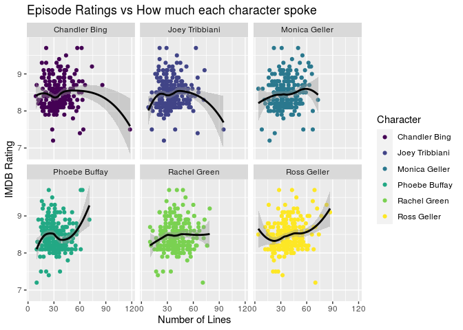

Project proposal
================
Team 404

``` r
library(tidyverse)
library(broom)
library(friends)
```

## 1\. Introduction

We are going to work with the “Friends” data package from TidyTuesday.
It was aggregated, packaged, and shared by Emil Hvitfeldt. We load it
from the `friends` R package.

We will try to look behind the levels of popularity throughout all 10
seasons, and ask the ultimate question:

What makes the perfect “Friends” episode?

The package consists of 4 data sets:

friends : consists of 67,373 rows and 6 columns. It is a transcript of
all dialogues where each row represents an utterance. The variables
contain information on `text`, the `speaker`, `episode`, `season`,
`scene`, and the number of utterance - `utterance`;

friends\_emotions : consists of 12,606 rows and 5 columns. Each row
representing an utterance, variables give information on the number of
each `utterance` and its `emotion`, with specified `scene`, `episode`,
and `season` number;

friends\_entities : consists of 10.557 rows and 5 columns. Each row
being one utterance, variables show detail on utterance number -
`utterance`, `entity`, `scene`, `episode`, `season`;

friends\_info : consists of 236 rows and 8 columns. Each row represents
an episode. Variables are: title, episode number, season number, name of
writer and director, airing date, number of views and IMDB ratings.

## 2\. Data

``` r
glimpse(friends)
```

    ## Rows: 67,373
    ## Columns: 6
    ## $ text      <chr> "There's nothing to tell! He's just some guy I work with!",…
    ## $ speaker   <chr> "Monica Geller", "Joey Tribbiani", "Chandler Bing", "Phoebe…
    ## $ season    <int> 1, 1, 1, 1, 1, 1, 1, 1, 1, 1, 1, 1, 1, 1, 1, 1, 1, 1, 1, 1,…
    ## $ episode   <int> 1, 1, 1, 1, 1, 1, 1, 1, 1, 1, 1, 1, 1, 1, 1, 1, 1, 1, 1, 1,…
    ## $ scene     <int> 1, 1, 1, 1, 1, 1, 1, 1, 1, 1, 1, 1, 1, 1, 1, 1, 1, 1, 1, 1,…
    ## $ utterance <int> 1, 2, 3, 4, 5, 6, 7, 8, 9, 10, 11, 12, 13, 14, 15, 16, 17, …

``` r
glimpse(friends_emotions)
```

    ## Rows: 12,606
    ## Columns: 5
    ## $ season    <int> 1, 1, 1, 1, 1, 1, 1, 1, 1, 1, 1, 1, 1, 1, 1, 1, 1, 1, 1, 1,…
    ## $ episode   <int> 1, 1, 1, 1, 1, 1, 1, 1, 1, 1, 1, 1, 1, 1, 1, 1, 1, 1, 1, 1,…
    ## $ scene     <int> 4, 4, 4, 4, 4, 4, 4, 4, 4, 4, 4, 4, 4, 4, 4, 4, 4, 5, 5, 5,…
    ## $ utterance <int> 1, 3, 4, 5, 6, 7, 8, 10, 11, 12, 13, 14, 15, 16, 17, 18, 19…
    ## $ emotion   <chr> "Mad", "Neutral", "Joyful", "Neutral", "Neutral", "Neutral"…

``` r
glimpse(friends_info)
```

    ## Rows: 236
    ## Columns: 8
    ## $ season            <int> 1, 1, 1, 1, 1, 1, 1, 1, 1, 1, 1, 1, 1, 1, 1, 1, 1, …
    ## $ episode           <int> 1, 2, 3, 4, 5, 6, 7, 8, 9, 10, 11, 12, 13, 14, 15, …
    ## $ title             <chr> "The Pilot", "The One with the Sonogram at the End"…
    ## $ directed_by       <chr> "James Burrows", "James Burrows", "James Burrows", …
    ## $ written_by        <chr> "David Crane & Marta Kauffman", "David Crane & Mart…
    ## $ air_date          <date> 1994-09-22, 1994-09-29, 1994-10-06, 1994-10-13, 19…
    ## $ us_views_millions <dbl> 21.5, 20.2, 19.5, 19.7, 18.6, 18.2, 23.5, 21.1, 23.…
    ## $ imdb_rating       <dbl> 8.3, 8.1, 8.2, 8.1, 8.5, 8.1, 9.0, 8.1, 8.2, 8.1, 8…

## 3\. Data analysis plan

We will explore this question through a number of visualizations. We
will use the IMDB rating (imdb\_rating) of each episode as the response
variable to evaluate the impact of each factor on the quality of the
episode.

The factors which we will explore include: the characters (speaker)
which appear with the most prominence, the tone (emotion), the
writer(written\_by), and the director (directed\_by) of each episode. We
can also see which variable has the largest impact on viewer
satisfaction in this way.

``` r
friendsWanted <- friends %>%
  filter( 
    speaker == "Joey Tribbiani"|
    speaker == "Chandler Bing"|
    speaker == "Monica Geller"|
    speaker == "Phoebe Buffay"|
    speaker == "Rachel Green"|
    speaker == "Ross Geller"
  ) %>% 
  group_by(season, episode) %>% 
  count(speaker) %>%
  merge(friends_info, by=c("episode","season"))
```

``` r
friendsWanted %>% 
  ggplot(aes( x = n, y = imdb_rating, color = speaker))+
  geom_point()+
  geom_smooth(color = "black")+
  facet_wrap('.~speaker')+
  labs( title = "Episode Ratings vs How much each character spoke",
        x = "Number of Lines",
        y = "IMBD Rating",
        color = "Character"
      )+
  scale_color_viridis_d()
```

    ## `geom_smooth()` using method = 'loess' and formula 'y ~ x'

<!-- -->
